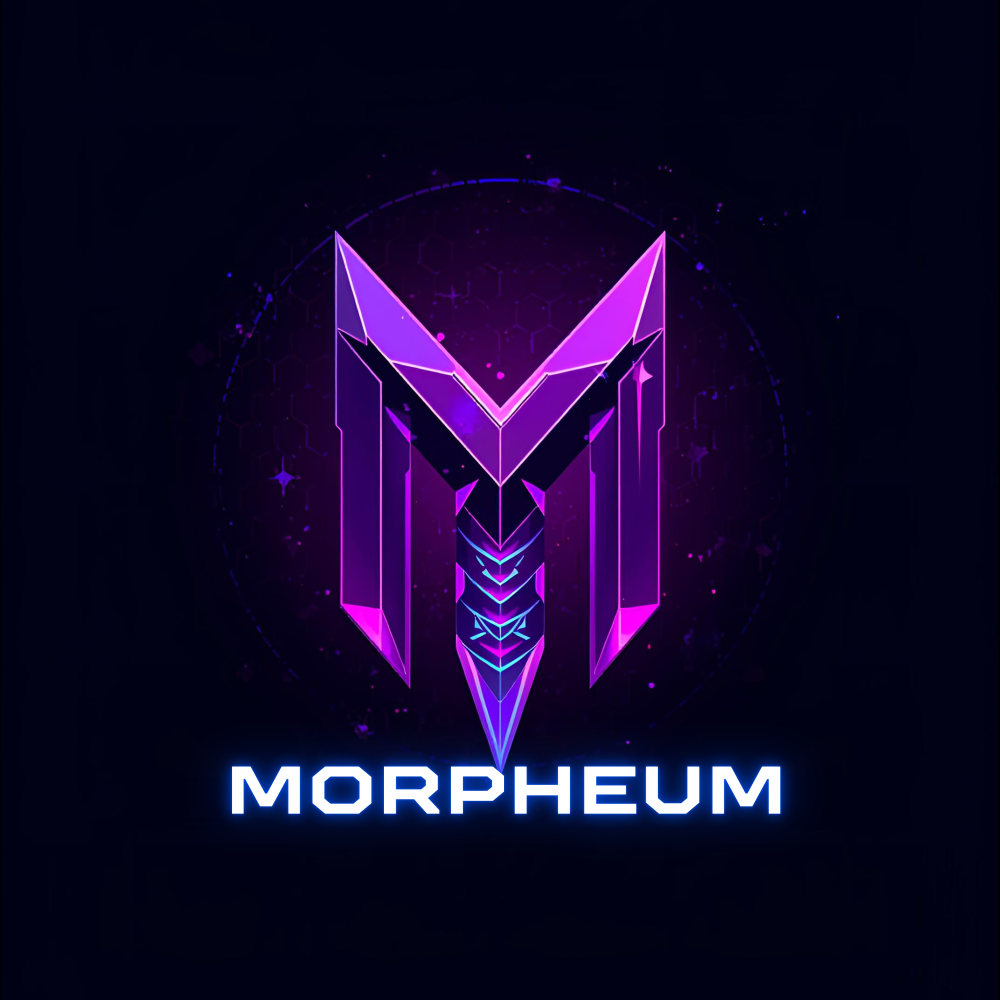
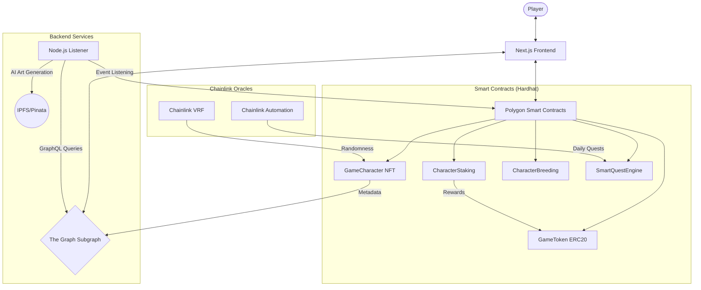

<div align="center">
  
  <h1>Morpheum: Dynamic NFT Gaming Ecosystem</h1>
  <p><strong>An advanced blockchain-based game where NFT characters evolve, level up, and can be staked or bred.</strong></p>

  [](https://soliditylang.org/)
  [](https://nextjs.org/)
  [](https://hardhat.org/)
  [](https://chain.link/)
  [](https://polygon.technology/)
  [](https://opensource.org/licenses/MIT)
</div>

---

## 📖 Table of Contents
- [Overview](#overview)
- [Key Features](#key-features)
- [System Architecture](#system-architecture)
- [Tech Stack](#tech-stack)
- [Project Structure](#project-structure)
- [Getting Started](#getting-started)
  - [Prerequisites](#prerequisites)
  - [Installation](#installation)
  - [Environment Configuration](#environment-configuration)
- [Running the Project](#running-the-project)
  - [1. Smart Contracts](#1-smart-contracts)
  - [2. Subgraph (Indexing)](#2-subgraph-indexing)
  - [3. Backend Services](#3-backend-services)
  - [4. Frontend Application](#4-frontend-application)
- [Security & Optimization](#security--optimization)
- [Contributing](#contributing)
- [License](#license)

---

## 🌟 Overview
Morpheum is a comprehensive Dynamic NFT (dNFT) ecosystem built on Polygon. It leverages on-chain metadata that evolves based on player actions. Characters gain experience, level up, and improve their stats through training, quests, and breeding. The project integrates Chainlink VRF for provably fair trait generation and Chainlink Automation for passive gameplay mechanics.

---

## ✨ Key Features
- **Dynamic NFTs (ERC721):** Upgradeable characters with evolving on-chain traits (Level, XP, Stats).
- **Provable Randomness:** Integration with Chainlink VRF for initial trait generation and loot boxes.
- **Staking Rewards:** Stake your NFTs to earn native **GAME tokens** (ERC20).
- **Breeding & Fusion:** Complex genetic inheritance system to create unique offspring.
- **Achievement System:** Soulbound (ERC5192) badges for player milestones.
- **Quest Engine:** Smart contract-based daily quests and automated XP gains.
- **AI Art Generation:** Dynamic art updates based on character evolution (backend integration).
- **High-Performance Indexing:** The Graph protocol for real-time, efficient blockchain data querying.

---

## 🏗 System Architecture

The following diagram illustrates the interaction between the different components of the Morpheum ecosystem:



---

## 🛠 Tech Stack

### Smart Contracts
- **Language:** Solidity ^0.8.20
- **Framework:** Hardhat
- **Libraries:** OpenZeppelin (Upgradeable, ERC721, ERC20)
- **Oracles:** Chainlink VRF v2, Chainlink Automation
- **Testing:** Chai, Ethers.js

### Frontend
- **Framework:** Next.js 14 (App Router)
- **Styling:** Tailwind CSS, shadcn/ui
- **Web3:** wagmi v2, viem, RainbowKit
- **State Management:** TanStack Query, Zustand

### Backend & Indexing
- **Indexer:** The Graph Protocol (AssemblyScript)
- **Backend:** Node.js, Express, TypeScript
- **AI/Art:** OpenAI/Pinata Integration
- **Database:** PostgreSQL (via Graph Node)

---

## 📁 Project Structure

```text
dynamic-nft-game/
├── contracts/          # Solidity smart contracts
├── frontend/           # Next.js web application
├── backend/            # Node.js event listeners & services
├── subgraph/           # The Graph indexing configuration
├── scripts/            # Deployment & utility scripts
├── test/               # Smart contract unit & integration tests
├── hardhat.config.ts   # Hardhat configuration
└── package.json        # Project-wide dependencies & scripts
```

---

## 🚀 Getting Started

### Prerequisites
- [Node.js](https://nodejs.org/) (v18.0.0 or higher)
- [npm](https://www.npmjs.com/) or [yarn](https://yarnpkg.com/)
- [Git](https://git-scm.com/)
- [Docker](https://www.docker.com/) (optional, for local Graph Node)

### Installation
1. Clone the repository:
   ```bash
   git clone https://github.com/771salameche/dynamic-nft-game.git
   cd dynamic-nft-game
   ```

2. Install root dependencies:
   ```bash
   npm install
   ```

3. Install sub-module dependencies:
   ```bash
   # Install Frontend dependencies
   cd frontend && npm install && cd ..
   
   # Install Backend dependencies
   cd backend && npm install && cd ..
   
   # Install Subgraph dependencies
   cd subgraph && npm install && cd ..
   ```

### Environment Configuration
Copy the `.env.example` files in each directory and fill in your credentials:

**Root (.env):**
```bash
POLYGON_AMOY_RPC_URL=your_rpc_url
PRIVATE_KEY=your_private_key
POLYGONSCAN_API_KEY=your_api_key
```

**Frontend (frontend/.env.local):**
```bash
NEXT_PUBLIC_WALLETCONNECT_PROJECT_ID=your_id
NEXT_PUBLIC_CHAIN_ID=80002
```

**Backend (backend/.env):**
```bash
PINATA_API_KEY=your_key
PINATA_SECRET_API_KEY=your_secret
OPENAI_API_KEY=your_openai_key
```

---

## 💻 Running the Project

### 1. Smart Contracts
Compile and test the contracts:
```bash
# Compile
npm run compile

# Run tests
npm run test

# Deploy to Amoy Testnet
npm run deploy:amoy
```

### 2. Subgraph (Indexing)
Deploy the subgraph to index contract events:
```bash
cd subgraph
# Generate types
npm run codegen

# Build
npm run build

# Deploy (Studio)
npm run deploy
```

### 3. Backend Services
Run the event listeners and art generation service:
```bash
cd backend
# Start all listeners (Mint, Quests, etc.)
npm run listen:all

# Start API server
npm run dev
```

### 4. Frontend Application
Start the development server:
```bash
cd frontend
npm run dev
```
Navigate to `http://localhost:3000` to interact with the game.

---

## 🛡 Security & Optimization
- **Access Control:** Implemented using OpenZeppelin's `Ownable` and `AccessControl`.
- **Reentrancy Protection:** All financial functions use `nonReentrant` modifiers.
- **Gas Optimization:** 
  - Used `uint8`/`uint16` for small trait values.
  - Efficient struct packing in storage.
  - Custom errors instead of long string messages.
- **Upgradability:** Contracts use the UUPS (Universal Upgradeable Proxy Standard) pattern.

---

## 🤝 Contributing
1. Fork the Project
2. Create your Feature Branch (`git checkout -b feature/AmazingFeature`)
3. Commit your Changes (`git commit -m 'feat: Add some AmazingFeature'`)
4. Push to the Branch (`git push origin feature/AmazingFeature`)
5. Open a Pull Request

---

## 📄 License
Distributed under the MIT License. See `LICENSE` for more information.

---
<div align="center">
  <p>Built with ❤️ Dynamic NFT Gaming Ecosystem Project</p>
</div>
